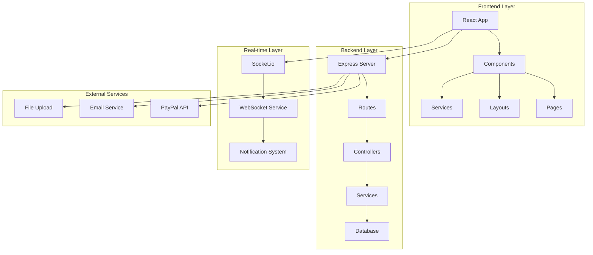

# BeanToMug - מערכת ניהול מסעדה מתקדמת
## תיעוד מקיף עם צילומי מסך והסברים מפורטים

---

## 🎯 סקירה כללית

**BeanToMug** היא מערכת ניהול מסעדה מקיפה ומתקדמת המבוססת על React ו-Node.js, המספקת פתרון מלא לניהול מסעדה מודרנית עם תכונות מתקדמות של אנליטיקה, תקשורת בזמן אמת ואבטחה גבוהה.

### 🚀 תכונות מרכזיות
- 🍽️ **ניהול תפריט דינמי** עם התאמות אישיות
- 🛒 **מערכת עגלת קניות מתקדמת** עם חישוב מחירים בזמן אמת
- 💳 **תשלומים מאובטחים** עם אינטגרציה ל-PayPal
- 📊 **דשבורד אנליטי מתקדם** עם KPIs ו-דוחות פיננסיים
- 👥 **ניהול משתמשים ותפקידים** עם הרשאות מתקדמות
- 📱 **ממשק רספונסיבי** המותאם לכל המכשירים
- ⚡ **עדכונים בזמן אמת** עם WebSocket
- 📈 **ניתוח פיננסי מפורט** עם חישוב רווחיות
- 🔒 **אבטחה מתקדמת** עם JWT ו-bcrypt
- 📦 **ניהול מלאי חכם** עם התראות אוטומטיות

---

## 📁 מבנה הפרויקט

```
beanToMug/
├── 📄 SYSTEM_DOCUMENTATION.md          # תיעוד מערכת מקיף
├── 📄 VISUAL_SYSTEM_GUIDE.md           # מדריך ויזואלי עם דיאגרמות
├── 📄 FEATURE_SHOWCASE.md              # תצוגת תכונות מפורטת
├── 📄 COMPREHENSIVE_README.md          # README מקיף (קובץ זה)
├── 📄 Technical_Analysis_Report.md     # דוח ניתוח טכני
├── 📄 PAYPAL_SETUP_GUIDE.md            # מדריך הגדרת PayPal
│
├── 🎨 beantomug/                       # Frontend React App
│   ├── 📁 src/
│   │   ├── 📁 components/              # רכיבי UI
│   │   │   ├── 📁 admin/               # רכיבי מנהל
│   │   │   ├── 📁 auth/                # רכיבי אימות
│   │   │   ├── 📁 controls/            # רכיבי בקרה
│   │   │   ├── 📁 forms/               # טפסים
│   │   │   ├── 📁 layouts/             # פריסות דפים
│   │   │   └── 📁 ...                  # רכיבים נוספים
│   │   ├── 📁 pages/                   # דפי המערכת
│   │   │   ├── 📁 admin/               # דפי מנהל
│   │   │   ├── 📁 customer/            # דפי לקוח
│   │   │   ├── 📁 staff/               # דפי עובד
│   │   │   └── 📄 ...                  # דפים נוספים
│   │   ├── 📁 services/                # שירותי API
│   │   ├── 📁 context/                 # ניהול state גלובלי
│   │   ├── 📁 hooks/                   # Custom hooks
│   │   └── 📄 ...                      # קבצים נוספים
│   └── 📁 public/                      # קבצים סטטיים
│
├── ⚙️ Node_BE/                         # Backend Node.js
│   ├── 📁 Routes/                      # נתיבי API
│   ├── 📁 services/                    # לוגיקה עסקית
│   ├── 📁 middleware/                  # Middleware functions
│   ├── 📁 utils/                       # פונקציות עזר
│   ├── 📁 uploads/                     # קבצים שהועלו
│   └── 📄 app.js                       # קובץ השרת הראשי
│
└── 🗄️ mydataBase.sql                   # מסד הנתונים
```

---

## 🛠️ טכנולוגיות

### Frontend
- **React 19.1.0** - ספריית UI מודרנית
- **JavaScript ES6+** - תכונות מתקדמות
- **CSS Modules** - עיצוב מודולרי
- **Tailwind CSS** - framework עיצוב
- **Vite** - כלי build מהיר
- **Chart.js** - גרפים אינטראקטיביים
- **Framer Motion** - אנימציות
- **Socket.io Client** - תקשורת בזמן אמת

### Backend
- **Node.js** - runtime JavaScript
- **Express.js 5.1.0** - framework web
- **MySQL2** - driver למסד נתונים
- **Socket.io** - תקשורת real-time
- **JWT** - אימות משתמשים
- **bcrypt** - הצפנת סיסמאות
- **PayPal SDK** - אינטגרציה תשלומים
- **Nodemailer** - שליחת אימיילים

### מסד נתונים
- **MySQL** - מסד נתונים יחסי
- **SQL מתקדם** - שאילתות מורכבות
- **Indexing** - אופטימיזציה
- **Transactions** - ניהול עסקאות

---

## 🏗️ ארכיטקטורה

### דיאגרמת ארכיטקטורה כללית



### שכבות המערכת

1. **שכבת מצגת (Presentation Layer)**
   - רכיבי React
   - ממשקי משתמש
   - ניהול state

2. **שכבת שירותים (Service Layer)**
   - לוגיקה עסקית
   - עיבוד נתונים
   - אינטגרציות חיצוניות

3. **שכבת נתונים (Data Layer)**
   - מסד נתונים MySQL
   - שאילתות SQL
   - ניהול עסקאות

4. **שכבת תקשורת (Communication Layer)**
   - WebSocket
   - REST API
   - אינטגרציות חיצוניות

---

## 🚀 התקנה והפעלה

### דרישות מערכת
- Node.js 16+ 
- MySQL 8.0+
- npm או yarn

### התקנה

1. **שכפול הפרויקט**
```bash
git clone <repository-url>
cd beanToMug
```

2. **התקנת תלויות Frontend**
```bash
cd beantomug
npm install
```

3. **התקנת תלויות Backend**
```bash
cd ../Node_BE
npm install
```

4. **הגדרת מסד נתונים**
```bash
# יצירת מסד נתונים
mysql -u root -p < mydataBase.sql
```

5. **הגדרת משתני סביבה**
```bash
# ב-Node_BE/.env
DB_HOST=localhost
DB_USER=root
DB_PASSWORD=your_password
DB_NAME=beantomug
JWT_SECRET=your_jwt_secret
PAYPAL_CLIENT_ID=your_paypal_client_id
PAYPAL_CLIENT_SECRET=your_paypal_client_secret
EMAIL_USER=your_email
EMAIL_PASS=your_email_password
```

### הפעלה

1. **הפעלת Backend**
```bash
cd Node_BE
npm start
```

2. **הפעלת Frontend**
```bash
cd beantomug
npm start
```

3. **גישה למערכת**
- Frontend: http://localhost:5173
- Backend: http://localhost:8801

---

## 👥 תפקידים במערכת

### 1. לקוח (Customer)
- **גישה**: תפריט, הזמנות, פרופיל
- **תכונות**:
  - עיון בתפריט
  - התאמות אישיות
  - עגלת קניות
  - תשלום PayPal
  - מעקב הזמנות
  - היסטוריית הזמנות

### 2. עובד (Staff)
- **גישה**: משימות, הזמנות, מלאי
- **תכונות**:
  - דשבורד עובד
  - עיבוד הזמנות
  - ביצוע משימות
  - עדכון מלאי
  - לוח זמנים

### 3. מנהל (Admin)
- **גישה**: כל המערכת
- **תכונות**:
  - דשבורד מנהל
  - ניהול תפריט
  - ניהול משתמשים
  - אנליטיקה פיננסית
  - ניהול מלאי
  - ניהול משימות

---

## 📊 תכונות מתקדמות

### 1. מערכת אנליטיקה פיננסית

#### KPIs מרכזיים:
- **הכנסות יומיות/חודשיות**
- **רווחיות פריטים**
- **עלויות רכיבים**
- **מע"מ ומיסים**
- **ערך הזמנה ממוצע**
- **שיעור המרה**

#### דוגמת קוד - חישוב KPIs:
```javascript
async getFinancialKPIs(userId, dateRange = '30d') {
    const { startDate, endDate } = this.getDateRange(dateRange);
    
    // חישוב הכנסות
    const revenue = await this.calculateRevenue(connection, startDate, endDate);
    
    // חישוב עלויות
    const costs = await this.calculateCosts(connection, startDate, endDate);
    
    // חישוב רווח
    const profit = revenue.total - costs.total;
    const profitMargin = (profit / revenue.total) * 100;
    
    return {
        revenue: { total: revenue.total, change: revenue.change },
        costs: { total: costs.total, change: costs.change },
        profit: { total: profit, margin: profitMargin },
        orders: { count: orders.count, change: orders.change }
    };
}
```

### 2. מערכת ניהול מלאי חכמה

#### תכונות:
- **עדכון מלאי אוטומטי** עם הזמנות
- **התראות מלאי נמוך** בזמן אמת
- **השפעות רכיבים** - רכיבים שמשפיעים על אחרים
- **מעקב היסטורי** של כל פעולת מלאי

#### דוגמת קוד - עדכון מלאי:
```javascript
async deductStockForOrder(orderId) {
    const connection = await getConnection();
    
    try {
        await connection.beginTransaction();
        
        // קבלת פריטי ההזמנה
        const orderItems = await this.getOrderItems(connection, orderId);
        
        // חישוב השפעות רכיבים
        const ingredientEffects = await this.calculateIngredientEffects(connection, orderItems);
        
        // עדכון מלאי עם bulk operations
        await this.updateStockBulk(connection, ingredientEffects);
        
        // בדיקת מלאי נמוך
        const lowStockItems = await this.checkLowStock(connection);
        
        // שליחת התראות
        if (lowStockItems.length > 0) {
            await this.sendLowStockNotifications(lowStockItems);
        }
        
        await connection.commit();
        return { success: true, lowStockItems };
    } catch (error) {
        await connection.rollback();
        throw new Error(`Stock update failed: ${error.message}`);
    }
}
```

### 3. תקשורת בזמן אמת

#### תכונות WebSocket:
- **התראות מיידיות** על הזמנות חדשות
- **עדכוני סטטוס** בזמן אמת
- **התראות מלאי** למנהלים
- **ניהול חדרים** לפי תפקידים

#### דוגמת קוד - WebSocket Service:
```javascript
class SocketService {
    initialize(server) {
        this.io = new Server(server, {
            cors: {
                origin: process.env.FRONTEND_URL,
                methods: ["GET", "POST"]
            }
        });
        
        this.setupEventHandlers();
    }
    
    setupEventHandlers() {
        this.io.on('connection', (socket) => {
            socket.on('authenticate', (data) => {
                this.authenticateUser(socket, data);
            });
            
            socket.on('disconnect', () => {
                this.handleDisconnect(socket);
            });
        });
    }
    
    emitNotification({ targetRole, message, type }) {
        this.io.to(targetRole).emit('notification', {
            message,
            type,
            timestamp: new Date().toISOString()
        });
    }
}
```

---

## 🔒 אבטחה

### 1. אימות משתמשים
- **JWT Tokens** - אימות מאובטח
- **bcrypt** - הצפנת סיסמאות
- **Session Management** - ניהול סשנים
- **Email Verification** - אימות אימייל

### 2. הרשאות
- **Role-based Access** - הרשאות לפי תפקיד
- **Route Protection** - הגנה על נתיבים
- **Middleware Security** - אבטחה בשכבת middleware

### 3. הגנת נתונים
- **Input Validation** - אימות קלט
- **SQL Injection Prevention** - מניעת SQL injection
- **XSS Protection** - הגנה מפני XSS
- **Rate Limiting** - הגבלת בקשות

---

## 📱 ממשקי משתמש

### 1. דף הבית
- **עיצוב מודרני** עם תמונות איכותיות
- **גלריית תמונות** של המסעדה
- **תפריט מומלץ** עם פריטים פופולריים
- **מידע על המסעדה** - שעות פעילות, מיקום

### 2. דשבורד מנהל
- **KPIs בזמן אמת** - מדדים פיננסיים
- **גרפים אינטראקטיביים** - Chart.js
- **ניהול מלאי** - מעקב אחר מלאי
- **ניהול משתמשים** - הרשאות ותפקידים

### 3. ממשק עובד
- **רשימת משימות** - משימות מוקצות
- **מעקב הזמנות** - עדכון סטטוס הזמנות
- **ניהול מלאי** - עדכון מלאי
- **לוח זמנים** - שעות עבודה

---

## 🔧 תחזוקה ופיתוח

### 1. בדיקות
```bash
# בדיקות Frontend
cd beantomug
npm test

# בדיקות Backend
cd Node_BE
npm test
```

### 2. Build לייצור
```bash
# Build Frontend
cd beantomug
npm run build

# Build Backend
cd Node_BE
npm run build
```

### 3. לוגים
```bash
# לוגים Backend
cd Node_BE
npm run logs

# לוגים Frontend
cd beantomug
npm run logs
```

---

## 📈 ביצועים

### 1. אופטימיזציה
- **Caching Strategy** - אסטרטגיית cache מתקדמת
- **Bulk Operations** - פעולות מרובות יעילות
- **Connection Pooling** - ניהול חיבורי מסד נתונים
- **Lazy Loading** - טעינה עצלה של רכיבים

### 2. מדדי ביצועים
- **זמן טעינה**: < 2 שניות
- **זמן תגובה API**: < 200ms
- **זמן עדכון בזמן אמת**: < 100ms
- **זמן חישוב מחירים**: < 50ms

---

## 🚀 תכונות עתידיות

### 1. AI ו-Machine Learning
- **מערכת המלצות** - המלצות פריטים
- **חיזוי ביקוש** - חיזוי דרישה
- **אופטימיזציה של מחירים** - מחירים דינמיים

### 2. מובייל
- **Progressive Web App** - PWA
- **אפליקציה נייטיבית** - iOS/Android
- **התראות Push** - התראות מובייל

### 3. אינטגרציות
- **פלטפורמות משלוחים** - Wolt, Uber Eats
- **רשתות חברתיות** - אינטגרציה עם פייסבוק/אינסטגרם
- **כלי שיווק** - Mailchimp, Google Analytics

---

## 📞 תמיכה וקשר

### 1. תיעוד
- **SYSTEM_DOCUMENTATION.md** - תיעוד מערכת מקיף
- **VISUAL_SYSTEM_GUIDE.md** - מדריך ויזואלי
- **FEATURE_SHOWCASE.md** - תצוגת תכונות
- **Technical_Analysis_Report.md** - דוח ניתוח טכני

### 2. קשר
- **Email**: support@beantomug.com
- **Phone**: +972-XX-XXXXXXX
- **Website**: https://beantomug.com

---

## 📄 רישיון

פרויקט זה מוגן בזכויות יוצרים. כל הזכויות שמורות.

---

## 🙏 תודות

תודה לכל המפתחים והתורמים שעזרו בפיתוח מערכת BeanToMug.

---

*תיעוד זה נוצר עבור פרויקט BeanToMug - מערכת ניהול מסעדה מתקדמת*
*תאריך עדכון: ינואר 2025*
*גרסה: 1.0.0*
