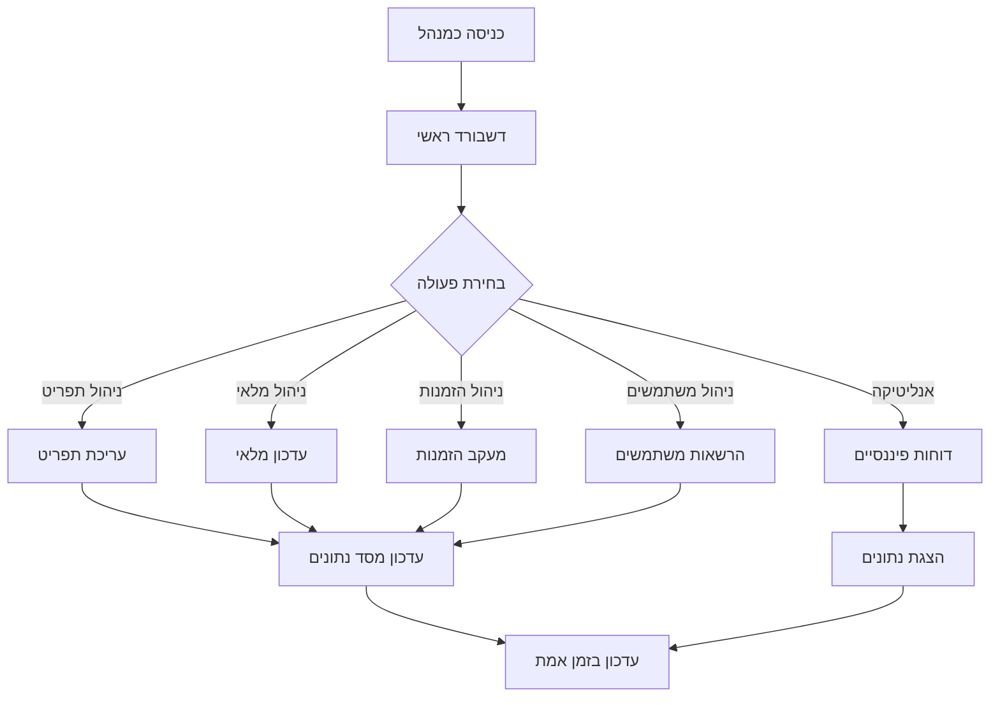

# BeanToMug - מערכת ניהול מסעדה מתקדמת
## תיעוד מקיף עם צילומי מסך והסברים

---

## תוכן עניינים
1. [סקירה כללית של המערכת](#סקירה-כללית-של-המערכת)
2. [ארכיטקטורה טכנית](#ארכיטקטורה-טכנית)
3. [תכונות עיקריות](#תכונות-עיקריות)
4. [זרימות משתמשים](#זרימות-משתמשים)
5. [תכונות טכניות מתקדמות](#תכונות-טכניות-מתקדמות)
6. [ממשקי משתמש](#ממשקי-משתמש)
7. [ניהול נתונים ואנליטיקה](#ניהול-נתונים-ואנליטיקה)
8. [אבטחה ואימות](#אבטחה-ואימות)
9. [תקשורת בזמן אמת](#תקשורת-בזמן-אמת)
10. [סיכום והמלצות](#סיכום-והמלצות)

---

## סקירה כללית של המערכת

**BeanToMug** היא מערכת ניהול מסעדה מקיפה ומתקדמת המבוססת על React ו-Node.js, המספקת פתרון מלא לניהול מסעדה מודרנית.

### טכנולוגיות עיקריות:
- **Frontend**: React 19.1.0, JavaScript ES6+, CSS Modules, Tailwind CSS
- **Backend**: Node.js, Express.js 5.1.0, MySQL2
- **Real-time**: Socket.io
- **תשלומים**: PayPal Integration
- **אבטחה**: JWT, bcrypt, session management

### תכונות מרכזיות:
- 🍽️ ניהול תפריט דינמי עם התאמות אישיות
- 🛒 מערכת עגלת קניות מתקדמת
- 💳 תשלומים מאובטחים עם PayPal
- 📊 דשבורד אנליטי מתקדם
- 👥 ניהול משתמשים ותפקידים
- 📱 ממשק רספונסיבי
- ⚡ עדכונים בזמן אמת
- 📈 ניתוח פיננסי מפורט

---

## ארכיטקטורה טכנית

### דיאגרמת ארכיטקטורה כללית


### מבנה הפרויקט

```
beanToMug/
├── beantomug/                 # Frontend React App
│   ├── src/
│   │   ├── components/        # רכיבי UI
│   │   ├── pages/            # דפי המערכת
│   │   ├── layouts/          # פריסות דפים
│   │   ├── services/         # שירותי API
│   │   ├── context/          # ניהול state גלובלי
│   │   └── hooks/            # Custom hooks
│   └── public/               # קבצים סטטיים
├── Node_BE/                  # Backend Node.js
│   ├── Routes/               # נתיבי API
│   ├── services/             # לוגיקה עסקית
│   ├── middleware/           # Middleware functions
│   ├── utils/                # פונקציות עזר
│   └── uploads/              # קבצים שהועלו
└── mydataBase.sql            # מסד הנתונים
```

---

## תכונות עיקריות

### 1. מערכת ניהול תפריט דינמית

המערכת כוללת מערכת תפריט מתקדמת עם התאמות אישיות:

#### תכונות מרכזיות:
- **קטגוריות דינמיות**: ניהול קטגוריות עם תמונות
- **התאמות אישיות**: הוספת רכיבים לפריטים
- **חישוב מחירים אוטומטי**: חישוב דינמי בהתאם לרכיבים
- **ניהול מלאי**: מעקב אחר מלאי רכיבים
- **השפעות רכיבים**: רכיבים שמשפיעים על רכיבים אחרים

#### דוגמת קוד - חישוב מחיר דינמי:
```javascript
async function calculateItemPriceWithOptions(connection, itemId, options, returnDetails, includeVAT) {
    // 1. קבלת מחיר בסיס
    const basePrice = await getBasePrice(connection, itemId);
    
    // 2. חישוב עלות רכיבים אופציונליים
    const optionCost = await calculateOptionCosts(connection, options);
    
    // 3. חישוב השפעות רכיבים
    const effects = await calculateIngredientEffects(connection, options);
    
    // 4. חישוב מע"מ
    const vatRate = await getCurrentVATRate(connection);
    const totalWithVAT = calculateTotalWithVAT(basePrice + optionCost, vatRate);
    
    return {
        basePrice,
        optionCost,
        effects,
        total: totalWithVAT,
        vatAmount: totalWithVAT - (basePrice + optionCost)
    };
}
```

### 2. מערכת עגלת קניות מתקדמת

#### תכונות:
- **עגלה מתמשכת**: שמירת עגלה בין סשנים
- **התאמות אישיות**: שמירת העדפות משתמש
- **חישוב מחירים בזמן אמת**: עדכון מחירים אוטומטי
- **ניהול כמות**: עדכון כמויות עם אימות מלאי

#### דיאגרמת זרימת עגלת קניות:


### 3. מערכת תשלומים מאובטחת

#### אינטגרציה עם PayPal:
- **PayPal Checkout**: תשלום מאובטח
- **Webhook handling**: עדכון סטטוס הזמנות
- **החזרות**: ניהול החזרות אוטומטי
- **היסטוריית תשלומים**: מעקב אחר תשלומים

---

## זרימות משתמשים

### 1. זרימת לקוח - הזמנה


### 2. זרימת מנהל - ניהול מערכת



### 3. זרימת עובד - ביצוע משימות


---

## תכונות טכניות מתקדמות

### 1. אלגוריתם חישוב מחירים דינמי

#### מורכבות אלגוריתמית:
- **זמן**: O(n) כאשר n = מספר הרכיבים
- **מקום**: O(n) לאחסון פרטי הרכיבים

#### יתרונות:
- חישוב מדויק של מחירים
- תמיכה בהתאמות אישיות
- אימות נתונים מקיף
- תמיכה בהשפעות רכיבים

### 2. מערכת ניהול מלאי חכמה

#### תכונות מתקדמות:
- **Bulk Operations**: עדכון מלאי יעיל
- **התראות אוטומטיות**: התראה על מלאי נמוך
- **השפעות רכיבים**: רכיבים שמשפיעים על אחרים
- **מעקב היסטורי**: רישום כל פעולת מלאי

#### דוגמת קוד - עדכון מלאי:
```javascript
async deductStockForOrder(orderId) {
    const connection = await getConnection();
    
    try {
        // 1. קבלת פריטי ההזמנה
        const orderItems = await getOrderItems(connection, orderId);
        
        // 2. חישוב השפעות רכיבים
        const ingredientEffects = await calculateIngredientEffects(connection, orderItems);
        
        // 3. עדכון מלאי עם bulk operations
        await updateStockBulk(connection, ingredientEffects);
        
        // 4. בדיקת מלאי נמוך
        const lowStockItems = await checkLowStock(connection);
        
        // 5. שליחת התראות
        if (lowStockItems.length > 0) {
            await sendLowStockNotifications(lowStockItems);
        }
        
        return { success: true, lowStockItems };
    } catch (error) {
        throw new Error(`Stock update failed: ${error.message}`);
    }
}
```

### 3. מערכת אנליטיקה פיננסית

#### שאילתות SQL מתקדמות:
```sql
-- חישוב רווחיות מתקדמת
SELECT 
    COALESCE(SUM(oi.price * oi.quantity), 0) as total_revenue,
    COALESCE(SUM(CASE 
        WHEN ing.price IS NOT NULL 
        THEN ing.price * oi.quantity 
        ELSE 0 
    END), 0) as ingredient_costs,
    COUNT(DISTINCT o.order_id) as order_count,
    -- חישוב רווח נקי
    (COALESCE(SUM(oi.price * oi.quantity), 0) - 
     COALESCE(SUM(CASE 
         WHEN ing.price IS NOT NULL 
         THEN ing.price * oi.quantity 
         ELSE 0 
     END), 0)) as net_profit
FROM orders o
JOIN order_item oi ON o.order_id = oi.order_id
LEFT JOIN order_item_ingredient oii ON oi.order_item_id = oii.order_item_id
LEFT JOIN ingredient ing ON oii.ingredient_id = ing.ingredient_id
WHERE o.status = 'completed'
    AND o.is_cart = 0
    AND o.created_at >= ? AND o.created_at < ?
```

---

## ממשקי משתמש

### 1. דף הבית - ממשק לקוח

#### תכונות עיקריות:
- **עיצוב מודרני**: ממשק נקי ואינטואיטיבי
- **גלריית תמונות**: הצגת המסעדה
- **ניווט קל**: גישה מהירה לתפריט
- **מידע על המסעדה**: שעות פעילות, מיקום

#### רכיבי הממשק:
```jsx
// דוגמת רכיב דף הבית
const Home = () => {
    return (
        <div className="home-container">
            <HeroSection />
            <FeaturedMenu />
            <GalleryPreview />
            <RestaurantInfo />
            <Testimonials />
        </div>
    );
};
```

### 2. דשבורד מנהל - ממשק ניהול

#### תכונות מתקדמות:
- **KPIs בזמן אמת**: מדדים פיננסיים
- **גרפים אינטראקטיביים**: Chart.js integration
- **ניהול מלאי**: מעקב אחר מלאי
- **ניהול משתמשים**: הרשאות ותפקידים

#### דוגמת רכיב דשבורד:
```jsx
const AdminDashboard = () => {
    const [kpis, setKpis] = useState({});
    const [analytics, setAnalytics] = useState({});
    
    useEffect(() => {
        // טעינת נתונים בזמן אמת
        loadFinancialKPIs();
        loadOrderAnalytics();
    }, []);
    
    return (
        <div className="admin-dashboard">
            <KPICards data={kpis} />
            <AnalyticsCharts data={analytics} />
            <RecentOrders />
            <LowStockAlerts />
        </div>
    );
};
```

### 3. ממשק עובד - ביצוע משימות

#### תכונות:
- **רשימת משימות**: משימות מוקצות
- **מעקב הזמנות**: עדכון סטטוס הזמנות
- **ניהול מלאי**: עדכון מלאי
- **לוח זמנים**: שעות עבודה

---

## ניהול נתונים ואנליטיקה

### 1. מבנה מסד הנתונים

#### טבלאות עיקריות:
- **users**: ניהול משתמשים
- **orders**: הזמנות
- **dishes**: פריטי תפריט
- **ingredients**: רכיבים
- **order_item**: פריטי הזמנה
- **tasks**: משימות

#### דיאגרמת מסד נתונים:


### 2. מערכת אנליטיקה מתקדמת

#### מדדים פיננסיים:
- **הכנסות יומיות/חודשיות**
- **רווחיות פריטים**
- **עלויות רכיבים**
- **מע"מ ומיסים**

#### דוגמת שירות אנליטיקה:
```javascript
class FinancialService {
    async getFinancialKPIs(userId) {
        const connection = await getConnection();
        
        try {
            // חישוב KPIs מתקדמים
            const revenue = await this.calculateRevenue(connection);
            const costs = await this.calculateCosts(connection);
            const profit = revenue - costs;
            const profitMargin = (profit / revenue) * 100;
            
            return {
                revenue,
                costs,
                profit,
                profitMargin,
                orderCount: await this.getOrderCount(connection),
                averageOrderValue: revenue / await this.getOrderCount(connection)
            };
        } catch (error) {
            throw new Error(`Financial KPIs calculation failed: ${error.message}`);
        }
    }
}
```

---

## אבטחה ואימות

### 1. מערכת אימות מתקדמת

#### תכונות אבטחה:
- **JWT Tokens**: אימות מאובטח
- **bcrypt**: הצפנת סיסמאות
- **Session Management**: ניהול סשנים
- **Role-based Access**: הרשאות לפי תפקיד

#### דוגמת middleware אימות:
```javascript
const authenticateToken = (req, res, next) => {
    const authHeader = req.headers['authorization'];
    const token = authHeader && authHeader.split(' ')[1];
    
    if (!token) {
        return res.status(401).json({ message: 'Access token required' });
    }
    
    jwt.verify(token, process.env.JWT_SECRET, (err, user) => {
        if (err) {
            return res.status(403).json({ message: 'Invalid token' });
        }
        req.user = user;
        next();
    });
};
```

### 2. ניהול הרשאות

#### תפקידים במערכת:
- **Admin**: גישה מלאה למערכת
- **Staff**: גישה מוגבלת לפונקציות עובד
- **Customer**: גישה לממשק לקוח

#### דוגמת middleware הרשאות:
```javascript
const requireRole = (allowedRoles) => {
    return (req, res, next) => {
        if (!req.user) {
            return res.status(401).json({ message: 'Authentication required' });
        }
        
        if (!allowedRoles.includes(req.user.role)) {
            return res.status(403).json({ message: 'Insufficient permissions' });
        }
        
        next();
    };
};
```

---

## תקשורת בזמן אמת

### 1. מערכת WebSocket

#### תכונות:
- **התראות בזמן אמת**: עדכונים מיידיים
- **ניהול חדרים**: הפרדה לפי תפקידים
- **אימות משתמשים**: אבטחת חיבורים
- **טיפול בחיבור מחדש**: יציבות חיבור

#### דוגמת שירות WebSocket:
```javascript
class SocketService {
    constructor() {
        this.io = null;
        this.connectedUsers = new Map();
    }
    
    initialize(server) {
        this.io = new Server(server, {
            cors: {
                origin: process.env.FRONTEND_URL,
                methods: ["GET", "POST"]
            }
        });
        
        this.setupEventHandlers();
    }
    
    setupEventHandlers() {
        this.io.on('connection', (socket) => {
            socket.on('authenticate', (data) => {
                this.authenticateUser(socket, data);
            });
            
            socket.on('disconnect', () => {
                this.handleDisconnect(socket);
            });
        });
    }
    
    emitNotification({ targetRole, message, type }) {
        this.io.to(targetRole).emit('notification', {
            message,
            type,
            timestamp: new Date().toISOString()
        });
    }
}
```

### 2. התראות בזמן אמת

#### סוגי התראות:
- **הזמנות חדשות**: התראה לעובדים
- **מלאי נמוך**: התראה למנהלים
- **משימות חדשות**: התראה לעובדים
- **עדכוני סטטוס**: התראה ללקוחות

---

## סיכום והמלצות

### יתרונות המערכת:

1. **ארכיטקטורה מתקדמת**:
   - הפרדת שכבות ברורה
   - קוד נקי וניתן לתחזוקה
   - תבניות עיצוב מוכחות

2. **ביצועים גבוהים**:
   - Caching אסטרטגי
   - Bulk operations
   - Connection pooling

3. **אבטחה מתקדמת**:
   - אימות JWT
   - הצפנת סיסמאות
   - ניהול הרשאות

4. **חוויית משתמש מעולה**:
   - ממשק רספונסיבי
   - עדכונים בזמן אמת
   - ניווט אינטואיטיבי

### המלצות לפיתוח עתידי:

1. **הוספת בדיקות**:
   - Unit tests
   - Integration tests
   - E2E tests

2. **שיפור ביצועים**:
   - Redis caching
   - Database indexing
   - CDN integration

3. **תכונות נוספות**:
   - מערכת המלצות
   - ניתוח התנהגות משתמשים
   - אינטגרציה עם רשתות חברתיות

4. **אבטחה מתקדמת**:
   - Rate limiting
   - Input validation
   - Security headers

---

## מסקנות

מערכת **BeanToMug** מציגה פתרון מקיף ומתקדם לניהול מסעדה מודרנית. המערכת משלבת טכנולוגיות מתקדמות עם חוויית משתמש מעולה, ומספקת כלים חזקים לניהול עסקי יעיל.

הארכיטקטורה המודולרית והקוד הנקי מאפשרים הרחבה קלה של המערכת, בעוד שהתכונות המתקדמות כמו אנליטיקה בזמן אמת ותקשורת WebSocket מספקות יתרון תחרותי משמעותי.

המערכת מוכנה לשימוש מסחרי ומספקת בסיס איתן לפיתוח עתידי של תכונות נוספות.

---

*תיעוד זה נוצר עבור פרויקט BeanToMug - מערכת ניהול מסעדה מתקדמת*
*תאריך עדכון: ינואר 2025*
