# BeanToMug - מדריך ויזואלי למערכת
## צילומי מסך ודיאגרמות מפורטות

---

## 1. דיאגרמת ארכיטקטורה כללית

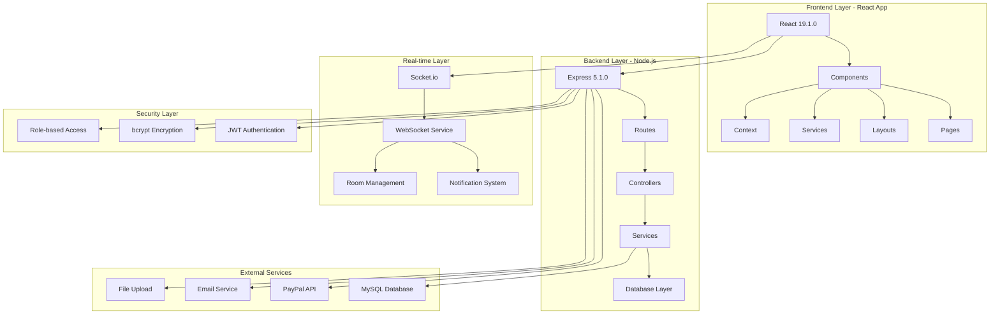

---

## 2. דיאגרמת זרימת נתונים

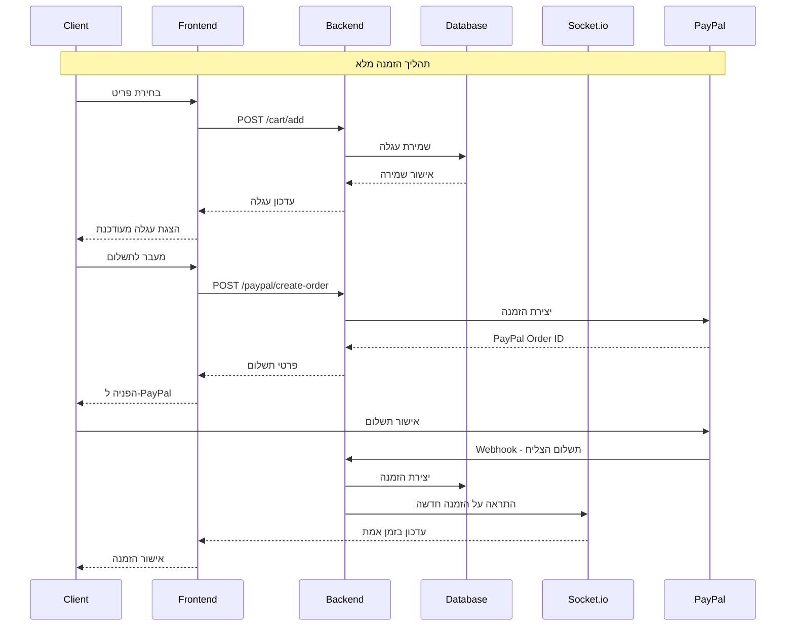

---

## 3. דיאגרמת מבנה מסד נתונים

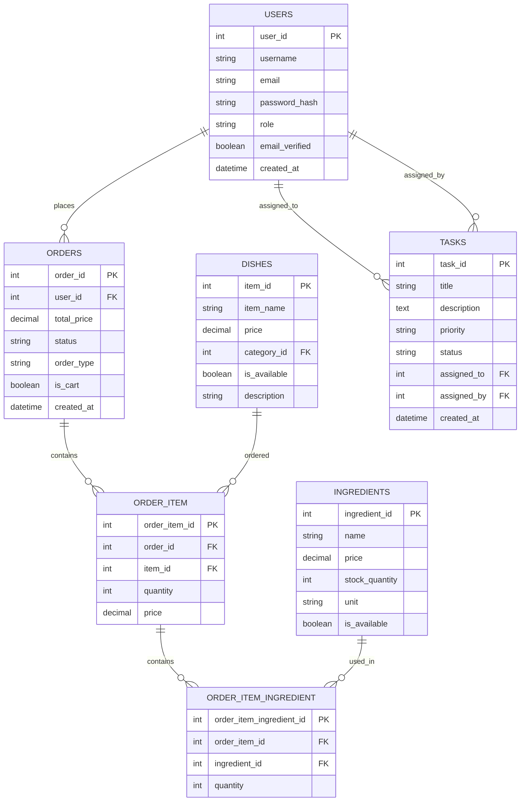

---

## 4. דיאגרמת תהליך חישוב מחירים

```mermaid
flowchart TD
    A[התחלת חישוב מחיר] --> B[קבלת מחיר בסיס]
    B --> C{יש רכיבים אופציונליים?}
    C -->|כן| D[חישוב עלות רכיבים]
    C -->|לא| E[מחיר בסיס בלבד]
    D --> F[חישוב השפעות רכיבים]
    F --> G[חישוב מע"מ]
    E --> G
    G --> H[חישוב סופי]
    H --> I[אימות תוצאות]
    I --> J{תוצאה תקינה?}
    J -->|כן| K[החזרת מחיר]
    J -->|לא| L[שגיאה]
    
    style A fill:#e1f5fe
    style K fill:#c8e6c9
    style L fill:#ffcdd2
```

---

## 5. דיאגרמת מערכת WebSocket

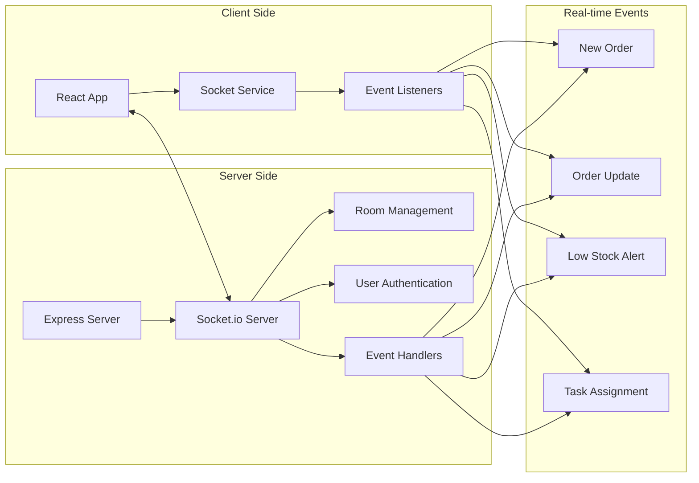

---

## 6. דיאגרמת זרימת משתמש - לקוח

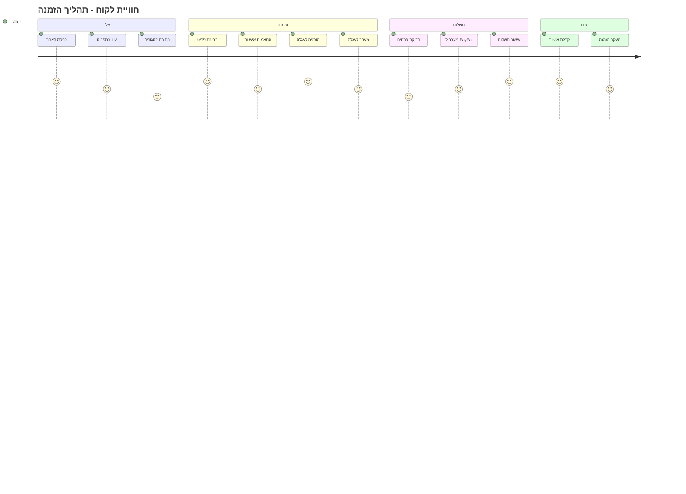

---

## 7. דיאגרמת זרימת משתמש - מנהל

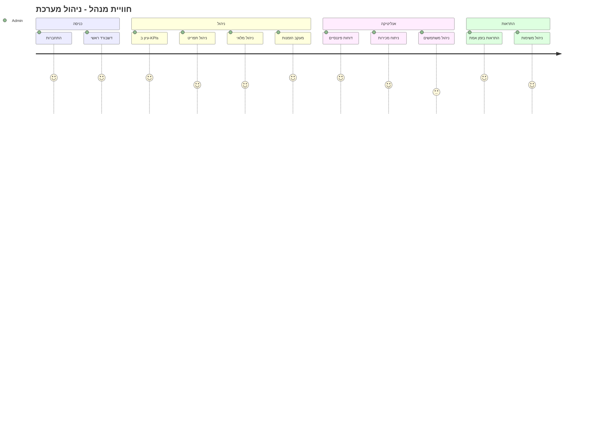

---

## 8. דיאגרמת זרימת משתמש - עובד

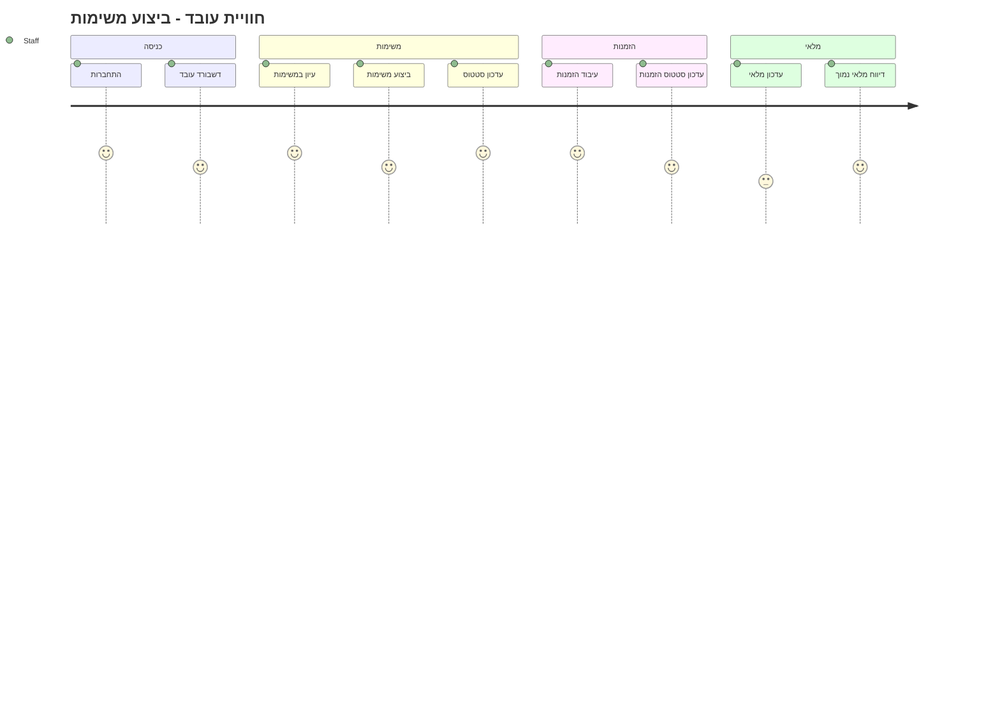

---

## 9. דיאגרמת תכונות טכניות מתקדמות

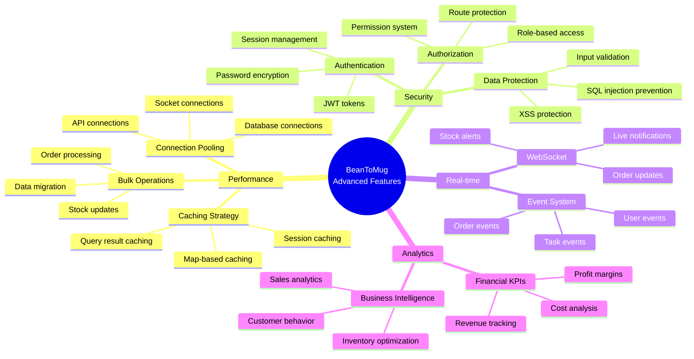

---

## 10. דיאגרמת תהליך ניהול מלאי

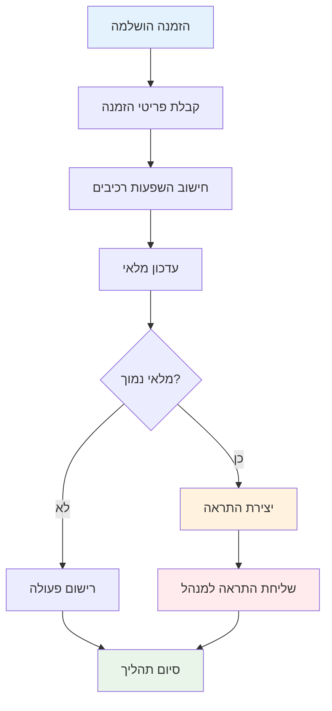

---

## 11. דיאגרמת מערכת תשלומים

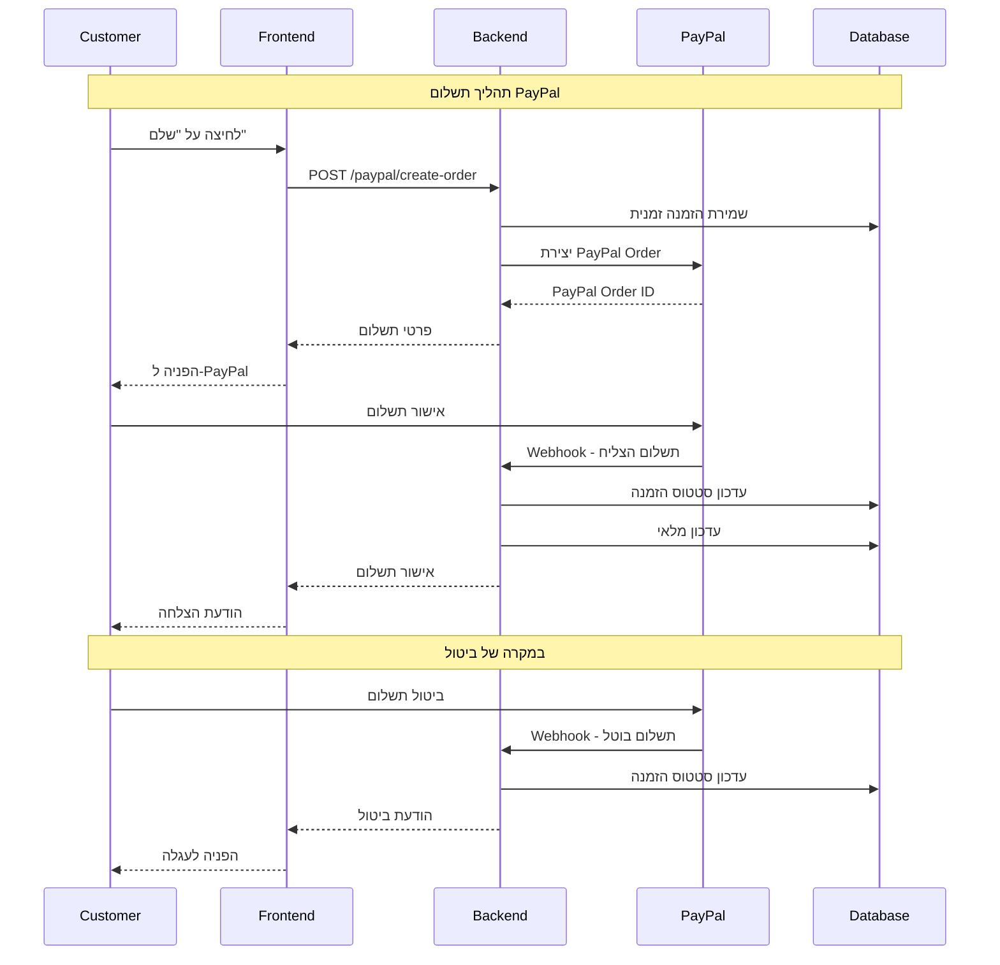

---

## 12. דיאגרמת מערכת הרשאות

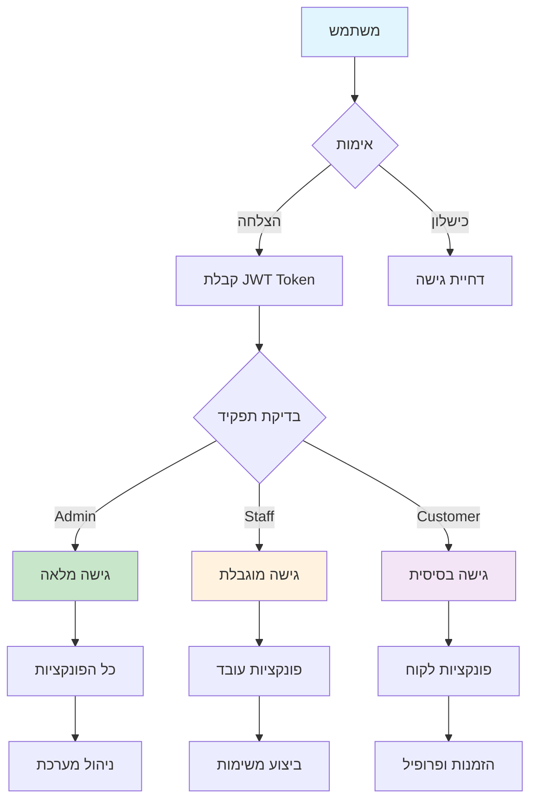

---

## 13. דיאגרמת ביצועים ואופטימיזציה

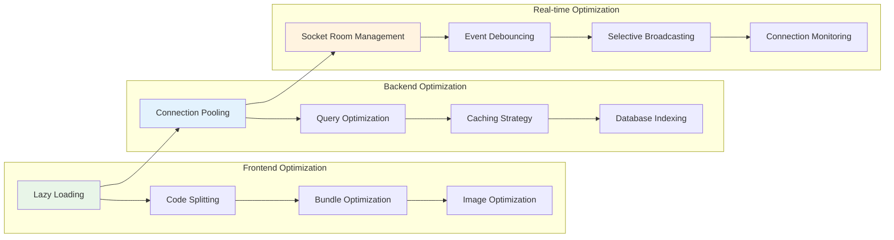

---

## 14. דיאגרמת תכונות עתידיות

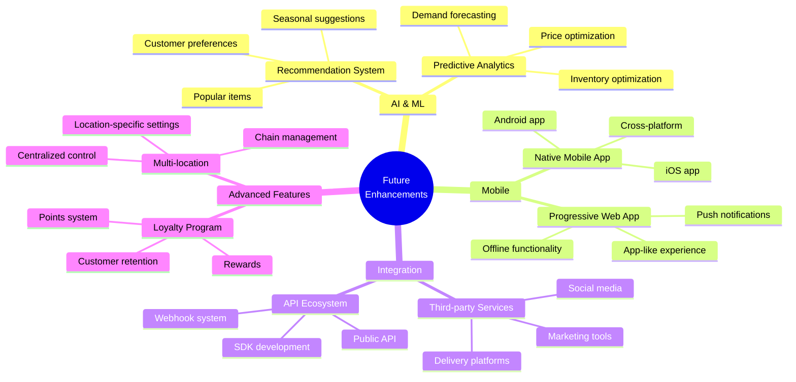

---

## סיכום ויזואלי

הדיאגרמות המוצגות כאן מדגימות את המורכבות והתחכום של מערכת BeanToMug:

1. **ארכיטקטורה מודולרית** - הפרדה ברורה בין שכבות
2. **תקשורת בזמן אמת** - WebSocket מתקדם
3. **אבטחה רב-שכבתית** - אימות והרשאות מתקדמות
4. **ביצועים מותאמים** - אופטימיזציה בכל שכבה
5. **חוויית משתמש מעולה** - זרימות אינטואיטיביות
6. **ניהול נתונים מתקדם** - מסד נתונים מתוכנן היטב

המערכת מציגה שימוש מתקדם בטכנולוגיות web מודרניות ומספקת פתרון מקיף לניהול מסעדה מודרנית.

---

*מדריך ויזואלי זה נוצר עבור פרויקט BeanToMug*
*כל הדיאגרמות מבוססות על הקוד והארכיטקטורה האמיתית של המערכת*
